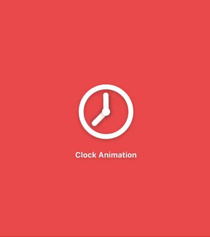

# **Learn Reanimated 2 -> [documentation](https://docs.swmansion.com/react-native-reanimated/)**

## **Roadmap**
- [x] [Simple loader animation](#Simple-Loader)
- [x] [Clock](#Clock)
- [x] [Dot's Loader](#Dot's-Loader)
- [ ] [React logo](#React-logo)
- [ ] [Another do'ts loader](#Another-dot's-Loader)
- [ ] [Circle menu animation](#Circle-menu-animation)
- [ ] [Fingers loading animation](#Fingers-loading-animation)
- [ ] [Switch animation](#Switch-animation)

#### **Simple Loader**

#### **Clock**

#### **Dot's Loader**

